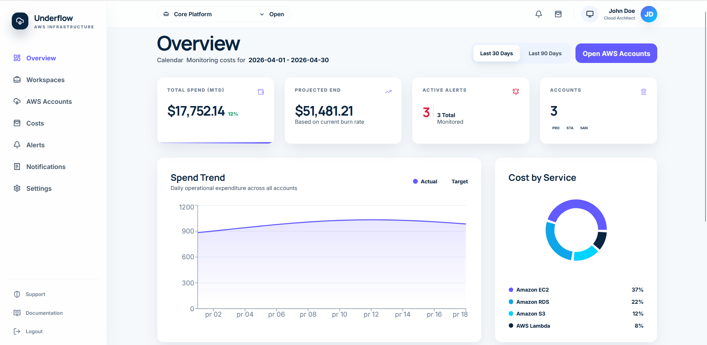
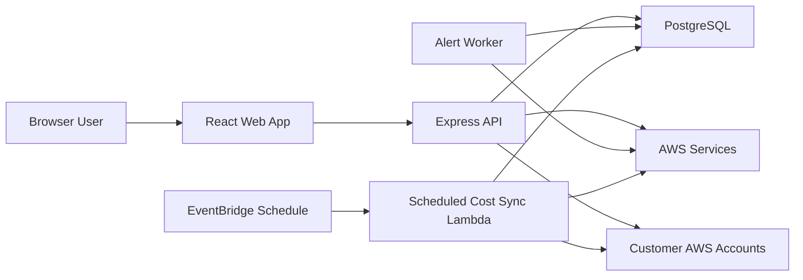

# Underflow





Technical walkthrough: [Architecture Overview](./docs/architecture.md)

Underflow is a live full-stack application for teams that need better visibility into AWS spend across multiple accounts and workspaces. It helps users connect AWS accounts through cross-account roles, sync cost data into a reporting layer, and track spend through dashboards, alerts, and notifications before costs drift too far.

## Problem

AWS cost tooling is powerful, but day-to-day cost visibility can still feel fragmented when a team is working across multiple environments, accounts, and owners. Underflow is built to reduce that friction by giving teams a focused place to:

- organize cloud spend by workspace
- connect multiple AWS accounts safely through AssumeRole
- review synced cost data without querying AWS live on every page load
- create alerts and notification flows around budget drift

## What Underflow Does

- centralizes workspace-based AWS cost monitoring
- stores connected-account metadata for secure cross-account access
- syncs and persists cost data for reporting and historical analysis
- exposes cost summaries, service breakdowns, timeseries views, and sync history
- supports alert creation, alert evaluation, and notification delivery
- includes session-based authentication, profile/session management, and password reset flows

## Core Capabilities

- Multi-workspace model for separating teams, environments, or clients
- AWS account onboarding through a standardized `AssumeRole` flow
- Persisted reporting model backed by PostgreSQL rather than live Cost Explorer requests on every view
- Budget alerts and notification workflows backed by worker processes
- EventBridge-scheduled Lambda execution for recurring verified-account cost sync
- SES-backed auth and alert email delivery
- Terraform-managed infrastructure for DNS, SES, CI/CD bootstrap, ECS, RDS, S3, and CloudFront

## How It Works



Underflow separates the customer-facing frontend, the API, the scheduled sync runtime, and the alert worker so cost collection, alert evaluation, and notification delivery can run independently from the UI. The backend assumes customer roles only when needed, while synced reporting data stays in PostgreSQL for fast dashboard queries.

## Tech Stack

### Backend

- Node.js
- TypeScript
- Express
- PostgreSQL
- AWS SDK (STS, Cost Explorer, SES)
- Stripe

### Frontend

- React
- TypeScript
- Vite
- React Router
- Vitest + Testing Library
- Recharts

### Infrastructure

- Terraform
- ECS Fargate
- AWS Lambda
- Amazon EventBridge
- Amazon RDS for PostgreSQL
- Amazon S3
- CloudFront
- Route 53
- Amazon SES
- GitHub Actions

## Deployment

Underflow is deployed as:

- a React frontend served from S3 through CloudFront
- an Express API running on ECS Fargate
- a scheduled Lambda for verified-account cost sync
- a background worker service for alert execution
- a PostgreSQL database on Amazon RDS
- AWS-managed DNS, certificates, and email infrastructure

For the deployment topology and operational setup, see:

- [docs/production-deployment.md](./docs/production-deployment.md)
- [docs/production-operations.md](./docs/production-operations.md)

## Local Development

### Before first run

- Install Node.js 20+ and npm
- Have PostgreSQL available locally
- Create local env files from the provided examples
- Run API migrations before starting the backend
- Treat Stripe/AWS/email credentials as optional unless you are validating real integrations

### 1. Configure environment files

```powershell
Copy-Item apps\api\.env.example apps\api\.env
Copy-Item apps\web\.env.example apps\web\.env
```

### 2. Install dependencies

```powershell
cd apps\api
npm install
cd ..\web
npm install
```

### 3. Start the backend

```powershell
cd apps\api
npm run migrate
npm run dev
```

In a second terminal, start background jobs:

```powershell
cd apps\api
npm run jobs
```

### 4. Start the frontend

```powershell
cd apps\web
npm run dev
```

Default local URLs:

- API: `http://localhost:3080`
- Web: `http://localhost:5174`

For a fuller setup guide, see [docs/local-development.md](./docs/local-development.md).

## Validation Commands

### API

```powershell
cd apps\api
npm run build
npm test
npm run test:db
```

### Web

```powershell
cd apps\web
npm run build
npm test
```

## Operational Notes

- SES and DNS infrastructure lives under [`infra/terraform`](./infra/terraform)
- the current production pattern uses:
  - `underflow.<domain>` for the web frontend
  - `api.underflow.<domain>` for the API
- scheduled cost sync runs through EventBridge + Lambda, while the ECS worker stays focused on alert evaluation
- Terraform can provision:
  - Route 53 hosted zone, SES identity, DKIM, MAIL FROM, and DMARC records
  - bootstrap CI/CD infrastructure such as Terraform remote state and GitHub OIDC
  - production ECS, RDS, S3, CloudFront, and ALB deployment topology

Additional references:

- [docs/architecture.md](./docs/architecture.md)
- [docs/customer-aws-onboarding.md](./docs/customer-aws-onboarding.md)
- [docs/status-and-limitations.md](./docs/status-and-limitations.md)
- [`infra/terraform/README.md`](./infra/terraform/README.md)

## License

This project is licensed under the terms in [LICENSE](./LICENSE).
